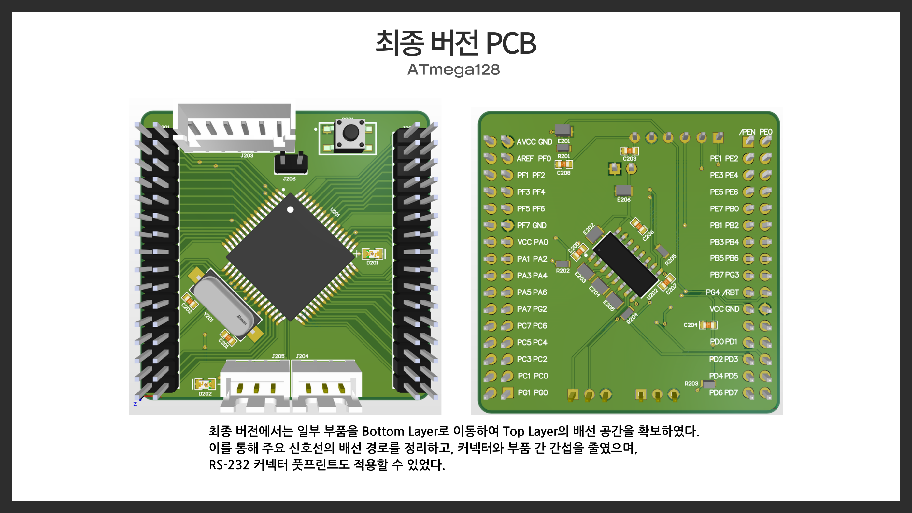
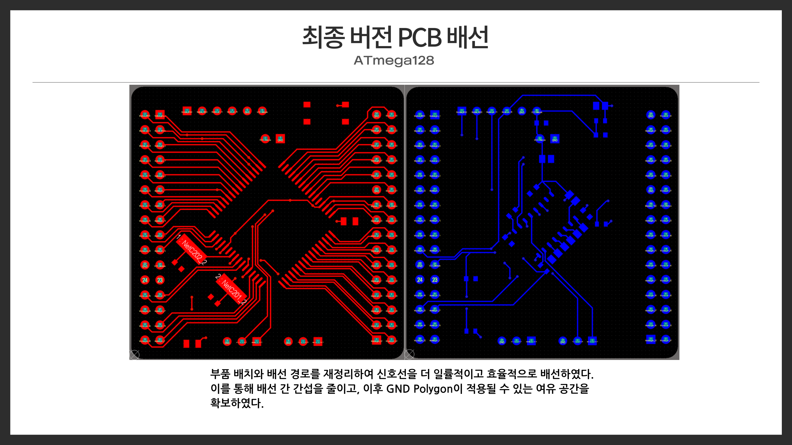
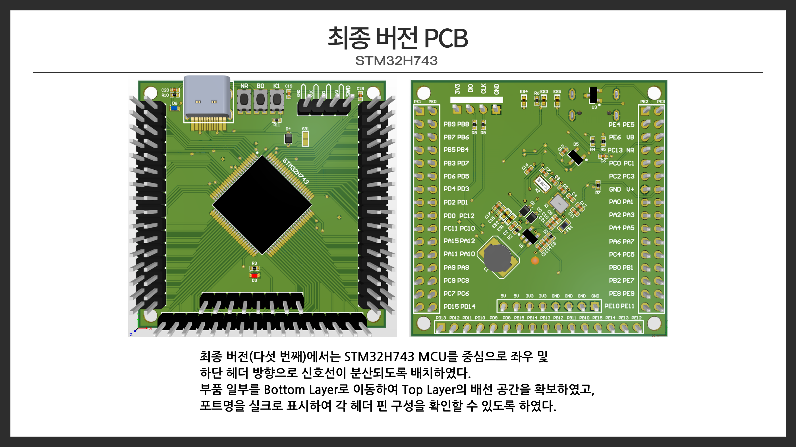
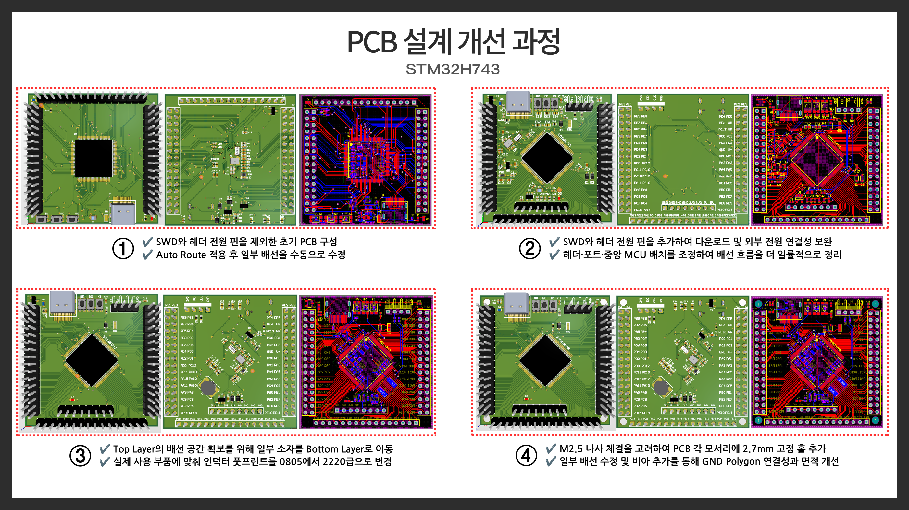
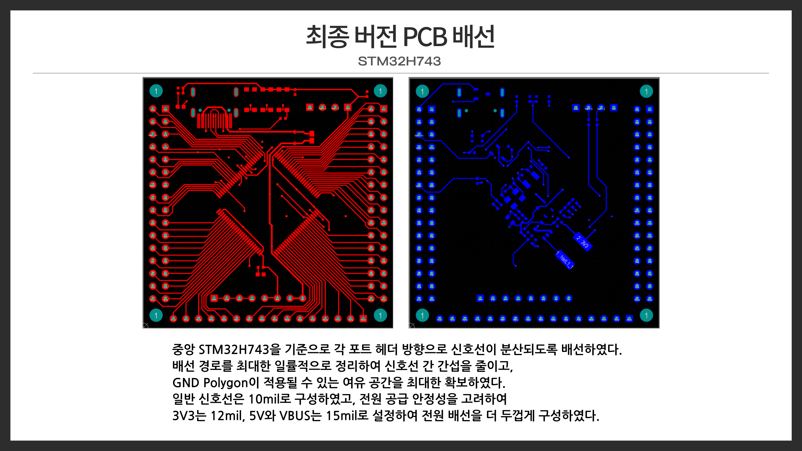
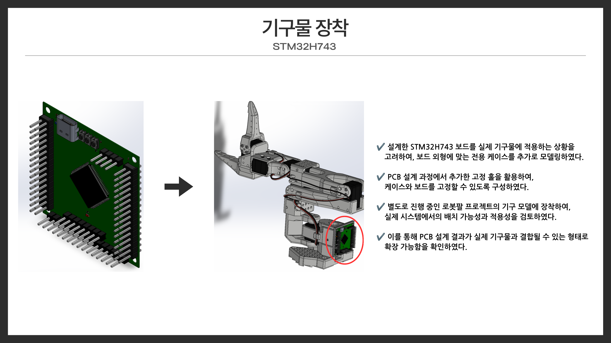

# 🔌 MCU PCB Design - ATmega128 & STM32H743

Altium Designer를 사용하여 **ATmega128**과 **STM32H743** 기반의 2-layer PCB를 설계한 대학 교과목 프로젝트입니다.

데이터시트를 바탕으로 회로를 구성하고 일부 Symbol / Footprint를 직접 제작했으며, 부품 배치와 배선, GND Polygon, DRC 검증, 3D 모델 확인까지 PCB 설계 전 과정을 수행했습니다.

## 🛠 Tools & Scope

- **EDA Tool**: Altium Designer
- **MCU**: ATmega128, STM32H743
- **Design**: Schematic, Symbol / Footprint, PCB Layout, Routing
- **Verification**: DRC (Design Rule Check)
- **Mechanical Review**: 3D PCB Model, Mounting Hole / Case Integration Review

---

## 1. ATmega128 PCB

ATmega128을 중심으로 전원, 클럭, 리셋, ISP 다운로드 커넥터, RS-232 통신 회로, 입출력 확장 커넥터를 포함한 보드를 설계했습니다.

주요 부품의 풋프린트를 데이터시트를 기준으로 구성하고, 초기 Top Layer 중심 배치에서 발생한 배선 공간 부족을 개선하기 위해 일부 부품을 Bottom Layer로 이동했습니다. 이를 통해 배선 경로와 부품 간 간섭을 정리하고 GND Polygon 영역을 확보했습니다.

  

### 주요 설계 내용

- ATmega128 TQFP64 Footprint 구성
- ISP / RS-232 Connector 적용
- MAX232A, Switch, Crystal 등 주요 부품 배치
- Top / Bottom Layer를 활용한 2-layer Routing
- GND Polygon 적용
- 최종 DRC Rule Violation 0

  

- [Altium Project](ATmega128/)
- [DRC Report](ATmega128/verification/DRC_Report.html)

---

## 2. STM32H743 PCB

STM32H743 기반 보드는 **MAIN / POWER / SWITCH** 회로로 분리하여 설계했습니다.

MAIN 회로에는 MCU 포트와 외부 헤더, 클럭, 리셋, SWD를 구성했고, POWER 회로에는 USB-C 입력과 3.3V 전원 변환 회로를 적용했습니다. SWITCH 회로에는 BOOT0, RESET, 사용자 입력 버튼을 구성했습니다.

  

### 주요 설계 내용

- STM32H743 LQFP100 Footprint 구성 및 3D Model 적용
- USB-C, SWD, BOOT0 / RESET / User Switch 구성
- 전원부 인덕터, Ferrite Bead, ESD / TVS / Schottky Diode 적용
- 실제 부품 규격을 반영한 Footprint 수정
- M2.5 체결을 고려한 2.7 mm Mounting Hole 추가
- 일부 부품 Bottom Layer 배치
- GND Via를 이용한 Top / Bottom Polygon 연결 보완
- 최종 DRC Warnings 0 / Rule Violations 0

### Routing Rule

| Net | Width |
| --- | ---: |
| General Signal | 10 mil |
| 3V3 | 12 mil |
| 5V | 15 mil |
| VBUS | 15 mil |

### Design Iteration

초기 설계 이후 SWD와 전원 연결을 보완하고, 부품 및 헤더 위치를 조정했으며, Bottom Layer 활용과 Footprint 수정, Mounting Hole 및 GND Via 추가를 통해 설계를 단계적으로 개선했습니다.

  

  

### Mechanical Integration Review

보드 외형과 고정 홀을 기준으로 전용 케이스를 모델링하고, 별도로 진행 중인 로봇팔 기구 모델에 장착하여 실제 시스템에서의 배치 가능성을 검토했습니다.

  

- [Altium Project](STM32H743/)
- [DRC Report](STM32H743/verification/DRC_Report.html)

---

## 📄 Design Report

설계 과정과 Footprint 제작, 배선 개선, Polygon, DRC, 3D 검토에 대한 전체 발표 자료입니다.

- [PCB Design Report (PDF)](docs/PCB_Design_Report.pdf)

## 📌 Project Type

- University Course Project
- PCB / Embedded Hardware Design
